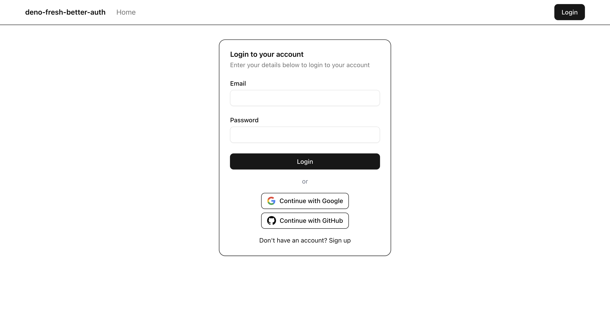

# Deno Fresh + Better Auth

Use [Fresh](https://fresh.deno.dev/) with [Better Auth](https://www.better-auth.com/) and [Drizzle ORM](https://orm.drizzle.team/) to create a web application with authentication:



## Quickstart

```bash
# Create env file
cp .env.example .env

# Start the database
docker compose up -d

# Install the dependencies
deno install

# Generate the types from the database schema
deno run -A npm:@better-auth/cli@latest generate --output db/auth-schema.ts --yes

# Generate the migrations
deno run -A --env-file --node-modules-dir npm:drizzle-kit generate --name=init

# Run the migrations
deno run -A --env-file --node-modules-dir npm:drizzle-kit migrate

# Confirm the tables are created
docker compose exec db psql -U authuser -d authdb -c "\dt"
docker compose exec db psql -U authuser -d authdb -c "\d user"

# Run the Dev server
deno task dev
```

## Social Login

Github: <https://www.better-auth.com/docs/authentication/github>

```bash
GITHUB_CLIENT_ID=123
GITHUB_CLIENT_SECRET=123
```

Google <https://www.better-auth.com/docs/authentication/google>

```bash
GOOGLE_CLIENT_ID=123
GOOGLE_CLIENT_SECRET=123
```

## Rate Limiting

According to Better Auth [docs](https://www.better-auth.com/docs/concepts/rate-limit), sign in is limited to 3 requests within 10 seconds.

We can test this with a script:

```bash
./scripts/test-rate-limit.sh
Signup HTTP 422

Attempt 1: 401 (Retry-After: -)
Attempt 2: 401 (Retry-After: -)
Attempt 3: 401 (Retry-After: -)
Attempt 4: 429 (Retry-After: 9)
```

## References

1. <https://deno.com/blog/build-database-app-drizzle>
2. <https://deno.com/blog/setup-auth-with-fresh>
3. <https://www.better-auth.com/docs/installation>
4. <https://www.better-auth.com/docs/basic-usage>
5. <https://www.better-auth.com/docs/adapters/postgresql>
6. <https://www.better-auth.com/docs/concepts/rate-limit>
